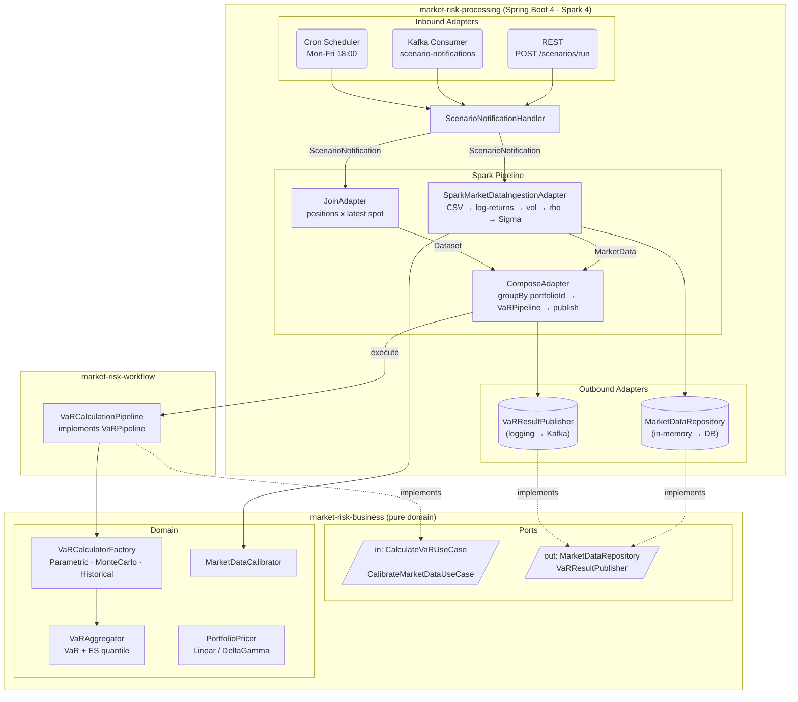
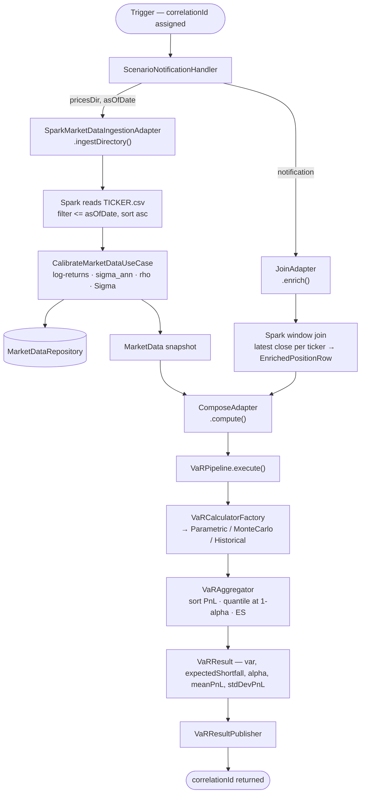

# Market Risk Quant Platform

[](https://github.com/kacemjd/market-risk-quant/actions/workflows/ci.yml)
[](https://codecov.io/gh/kacemjd/market-risk-quant)

Enterprise-grade VaR engine — Parametric, Monte Carlo (Cholesky GBM), and Historical Simulation — built on Hexagonal Architecture with Spring Boot 4 and Apache Spark 4.

---

## Stack

| Layer | Technology |
|---|---|
| Language | Java 21 |
| Framework | Spring Boot 4.0.5 |
| Compute | Apache Spark 4.0.0 (Scala 2.13) |
| Messaging | Apache Kafka (optional) |
| Build | Maven multi-module |

---

## Architecture

Three-module Maven project. Dependency direction is strictly inward: `processing → workflow → business`.

```
market-risk-quant/
├── market-risk-business/     pure domain — Java 21, zero framework
├── market-risk-workflow/     orchestration contracts — no Spring, no Spark
└── market-risk-processing/   Spring Boot 4 + Spark 4 application
```

### Hexagonal Layout



### Scenario Execution Flow



---

## Quick Start

**Prerequisites:** JDK 21+, Maven 3.9+

```bash
# full build + tests
mvn clean verify

# local dev — Spark in-process, REST on :8080
mvn spring-boot:run -pl market-risk-processing -Plocal

# REST trigger
java -jar market-risk-processing/target/market-risk-processing-*.jar \
  --spring.profiles.active=rest

# Kafka trigger
java -jar market-risk-processing/target/market-risk-processing-*.jar \
  --spring.profiles.active=kafka \
  --spring.kafka.bootstrap-servers=localhost:9092

# Cron EOD scheduler
java -jar market-risk-processing/target/market-risk-processing-*.jar \
  --scenario.schedule.enabled=true \
  --scenario.schedule.default-portfolio-path=/data/portfolio.csv \
  --scenario.schedule.default-prices-path=/data/prices
```

---

## REST API

```
POST /scenarios/run
Content-Type: application/json

{
  "portfolioCsvPath": "/data/portfolio.csv",
  "pricesCsvPath":    "/data/prices",
  "asOfDate":         "2024-12-31",
  "confidenceLevel":  0.99,
  "numPaths":         10000,
  "timeGrid":         "GRID_53"
}

HTTP 202 Accepted
{ "correlationId": "3fa85f64-5717-4562-b3fc-2c963f66afa6" }
```

Error responses follow `ScenarioRiskException` — `errorCode`, `status`, `message`, `violations[]`.

---

## Data Formats

**Portfolio CSV** — `portfolioId,ticker,quantity,assetClass`

**Prices CSV** — `Ticker,Date,Open,High,Low,Close,Volume,OpenInt`

The `Ticker` column identifies the risk factor. `Date` must be `YYYY-MM-DD`. Only `Ticker`, `Date`, and `Close` are consumed; other columns are ignored.

---

## Testing

```bash
# domain unit tests
mvn test -pl market-risk-business

# BDD (Cucumber)
mvn test -pl market-risk-business -Dtest=CucumberRunner

# integration test (full Spring Boot + Spark context)
mvn verify -pl market-risk-processing

# JMH benchmark — quadratic form delta-transposed-Sigma-delta
mvn test -pl market-risk-business -Dtest=VarianceComputationBenchmark#main -DfailIfNoTests=false
```

---

## Roadmap

**Sprint 1** — complete (8/8)

| Item | Status |
|---|---|
| Root package `com.kacemrisk.market.*`, `groupId` | Done |
| `Portfolio` typo fix | Done |
| REST validation + `ScenarioRiskException` | Done |
| `local` Maven profile (Spark `provided` → `compile`) | Done |
| Immutable `VaRAggregator` | Done |
| Port cleanup (`CalibrateMarketDataUseCase` wired) | Done |
| Delete dead `MonteCarloVaRPipeline` | Done |
| GitHub Actions CI | Done |

**Sprint 2** — TimescaleDB persistence, VaR result query API, Kafka publisher, Docker Compose, Flyway

**Sprint 3** — Component VaR (Euler allocation), Filtered Historical Simulation, Stress Testing, distributed Spark compute

**Sprint 4** — Micrometer + Prometheus, OpenTelemetry tracing, health checks

---

## Contributing

- Domain changes go in `market-risk-business` — the module must remain framework-free.
- New trigger mechanisms are inbound adapters under `market-risk-processing/adapter/in/`.
- New persistence or publishing targets are outbound adapters under `market-risk-processing/adapter/out/`.
- All new quant logic requires a Cucumber feature or JMH benchmark.
