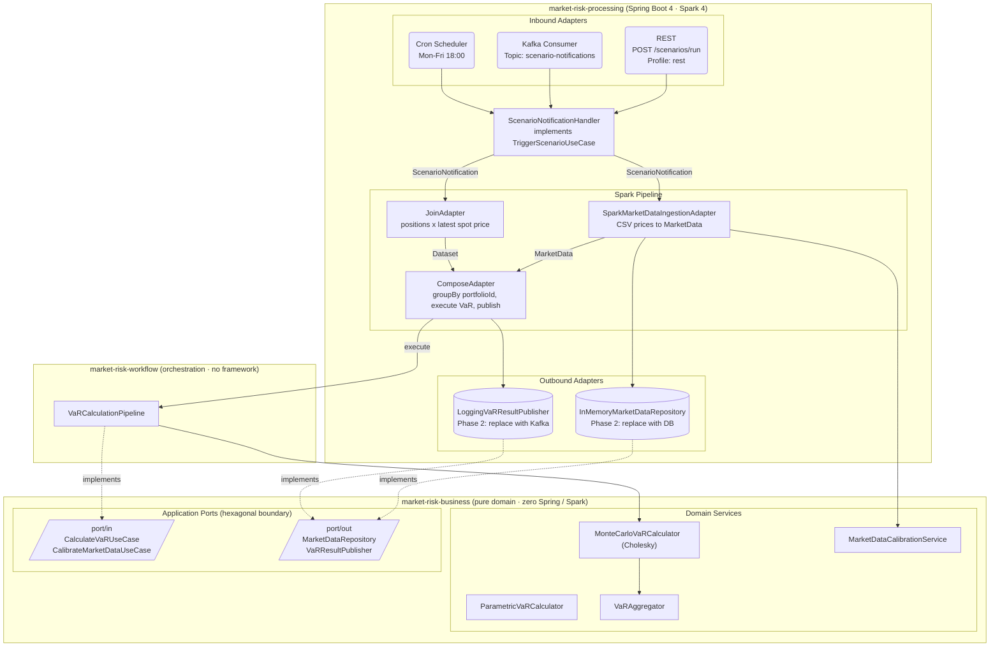
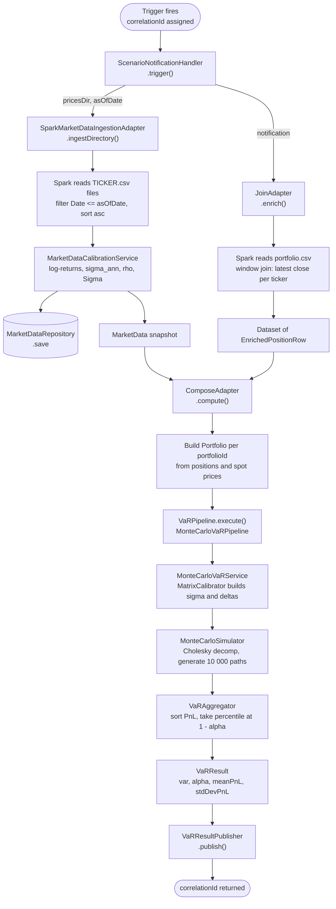

# Market Risk Quant Platform

> **Status:** Sprint 1 in progress — 4/8 tech-debt tasks done (package rename, Portfolio typo, REST validation, local Maven profile).  
> **Next:** Finish Sprint 1 (immutable VaRAggregator, port cleanup, CI) → Persistence → Quant depth (Component VaR, FHS, Stress Testing) → Observability.  
> **Target:** A fully-fledged, cloud-native market risk platform covering VaR, Greeks, stress testing, and real-time reporting.

---

## Table of Contents

1. [Vision](#vision)
2. [Tech Stack](#tech-stack)
3. [Architecture](#architecture)
4. [Module Guide](#module-guide)
5. [Phase 1 — What's Implemented](#phase-1--whats-implemented)
6. [Quick Start](#quick-start)
7. [Trigger Modes](#trigger-modes)
8. [Data Formats](#data-formats)
9. [Configuration Reference](#configuration-reference)
10. [Testing](#testing)
11. [Roadmap](#roadmap)

---

## Vision

The platform is designed to grow from a quantitative prototype into an enterprise-grade risk engine that a trading desk can run at end-of-day or intraday, with:

- **Multiple VaR methodologies** — Parametric, Monte Carlo, Historical Simulation
- **Full Greeks ladder** — Delta, Gamma, Vega, Theta for equity, FX, and rates books
- **Stress testing & scenario analysis** — regulatory (FRTB, Basel IV) and bespoke shocks
- **Real-time ingest** — streaming price feeds into a distributed Spark / Flink pipeline
- **Observability** — structured logging, metrics (Micrometer/Prometheus), distributed tracing
- **Reporting API** — REST + async results store, queryable by portfolio, date, and methodology

---

## Tech Stack

| Layer | Technology | Version |
|---|---|---|
| Language | Java | 21 |
| Framework | Spring Boot | 4.0.5 |
| Big-data processing | Apache Spark | 4.0.0 (Scala 2.13) |
| Linear algebra | Apache Commons Math3 | (via Spring BOM) |
| Messaging | Apache Kafka | (Spring Kafka, optional) |
| Build | Maven multi-module | 3.13+ |
| Boilerplate | Lombok | 1.18.36 |
| Logging | Logback | 1.5.21 |
| Unit / BDD tests | JUnit 5 · Cucumber | 5.11.4 · 7.22.0 |
| Micro-benchmarks | JMH | 1.37 |

---

## Architecture

The project follows **Hexagonal (Ports & Adapters)** architecture.  
The domain is framework-free; all Spring Boot and Spark code lives exclusively in the infrastructure module.



### Key Design Decisions

| Decision | Rationale |
|---|---|
| Framework-free domain | Domain logic is unit-testable without Spring context, Spark, or Kafka |
| Spark as ingestion bus | Scales from `local[*]` dev mode to YARN/K8s cluster with one config change |
| Conditional Kafka consumer | `@ConditionalOnProperty` — Kafka is completely off unless `spring.kafka.bootstrap-servers` is set |
| In-memory stubs for persistence | Deliberate Phase 1 scaffolding — ports are defined, swapping to real DB only touches the adapter |
| Monte Carlo with Cholesky decomposition | Correctly propagates inter-asset correlations; `seed` is configurable for reproducible tests |

> 📋 **[Architecture Review](docs/architecture-review.md)** — full scorecard, strengths, areas for improvement, and dependency direction verification.

### Scenario Execution Flow

End-to-end data flow from the moment a trigger fires to the published VaR result:



---

## Module Guide

### `market-risk-business` — Domain

Pure Java 21. No Spring, no Spark, no I/O.

```
com.kacemrisk.market/
├── domain/
│   ├── model/
│   │   ├── Portfolio.java
│   │   ├── Position.java
│   │   ├── MarketData.java
│   │   ├── VaRResult.java
│   │   ├── VaRMethod.java
│   │   ├── MaturityGrid.java
│   │   └── AssetClass.java
│   ├── service/
│   │   ├── simulation/
│   │   │   ├── analytical/ParametricVaRCalculator.java
│   │   │   ├── historical/HistoricalVaRCalculator.java
│   │   │   ├── stochastic/MonteCarloVaRCalculator.java
│   │   │   ├── stochastic/MarketShockGenerator.java
│   │   │   ├── VaRAggregator.java
│   │   │   ├── VaRCalculator.java
│   │   │   └── VaRCalculatorFactory.java
│   │   ├── calibration/
│   │   │   ├── MarketDataCalibrationService.java
│   │   │   ├── MarketDataCalibrator.java
│   │   │   └── MatrixCalibrator.java
│   │   └── pricing/
│   │       ├── Pricer.java
│   │       ├── LinearPricer.java
│   │       ├── DeltaGammaPricer.java
│   │       ├── PricerFactory.java
│   │       ├── PortfolioPricer.java
│   │       └── PricingUtils.java
│   └── exception/
│       ├── DomainException.java
│       └── VaRCalculationException.java
└── application/
    ├── port/
    │   ├── in/
    │   │   ├── CalculateVaRUseCase.java
    │   │   ├── CalculateVaRCommand.java
    │   │   └── CalibrateMarketDataUseCase.java
    │   └── out/
    │       ├── MarketDataRepository.java
    │       ├── PortfolioRepository.java
    │       └── VaRResultPublisher.java
    └── service/
        └── VaRService.java
```

See [`market-risk-business/README.md`](market-risk-business/README.md) for the full mathematical derivations (parametric VaR formula, covariance matrix build, Monte Carlo algorithm, and JMH benchmark results).

---

### `market-risk-workflow` — Orchestration

Defines the top-level use-case contracts and the pipeline wiring that connects the domain to the infrastructure.

| Class | Role |
|---|---|
| `TriggerScenarioUseCase` | Port — fire a named scenario and return its correlationId |
| `ScenarioNotification` | Immutable trigger payload (Lombok `@Value @Builder`) |
| `VaRPipeline` | Strategy interface — `execute(portfolio, marketData, notification)` |
| `VaRCalculationPipeline` | Active implementation — maps notification to `CalculateVaRCommand`, delegates to `CalculateVaRUseCase` |

`ScenarioNotification` default values:

| Field | Default |
|---|---|
| `confidenceLevel` | `0.99` |
| `numPaths` | `10 000` |
| `timeGrid` | `GRID_53` (53 weekly steps ≈ 1 year) |

---

### `market-risk-processing` — Infrastructure

Spring Boot 4 application. Entry point: `RiskPlatformApplication`.

```
infrastructure/
├── RiskPlatformApplication.java              Spring Boot entry point
├── ScenarioNotificationHandler.java          implements TriggerScenarioUseCase
│
├── adapter/
│   ├── in/
│   │   ├── kafka/
│   │   │   └── KafkaConfig.java              Consumer factory (conditional on property)
│   │   ├── rest/
│   │   │   ├── RestScenarioController.java   POST /scenarios/run  (Profile: rest)
│   │   │   ├── GlobalExceptionHandler.java   @RestControllerAdvice — 400/422/500 mapping
│   │   │   └── ScenarioRiskException.java    Error envelope with errorCode, violations[]
│   │   ├── scheduler/
│   │   │   └── ScheduledScenarioTrigger.java Cron EOD trigger     (conditional)
│   │   └── spark/
│   │       ├── SparkMarketDataIngestionAdapter.java  CSV prices → MarketData
│   │       ├── JoinAdapter.java              Positions × latest spot → EnrichedPositionRow
│   │       └── ComposeAdapter.java           Group by portfolio → VaR → publish
│   └── out/
│       ├── persistence/
│       │   ├── InMemoryMarketDataRepository.java     (→ replace with DB)
│       │   └── InMemoryPortfolioRepository.java      (→ replace with DB)
│       └── publisher/
│           └── LoggingVaRResultPublisher.java         (→ replace with Kafka/DB/REST)
│
├── config/
│   ├── DomainConfig.java                     Wires MarketDataCalibrationService, VaRPipeline
│   └── SparkConfig.java                      Creates singleton SparkSession
│
└── model/
    ├── ScenarioRequest.java                  REST request body
    ├── EnrichedPositionRow.java              Spark Dataset row (positions + spot price)
    └── VaRResultRow.java                     Spark Dataset row (output)
```

---

## Phase 1 — What's Implemented

### VaR Engines

#### 1. Parametric VaR

Assumes normally distributed P&L. Closed-form:

```
VaR_α = Φ⁻¹(α) × √(δᵀ Σ δ)
```

- Covariance matrix built from annualised volatilities and Pearson correlations
- Zero-allocation inner loop for the quadratic form (`computeVarianceLoop`)  
- BDD-tested via Cucumber (`parametric_var.feature`)

#### 2. Monte Carlo VaR

Full simulation over the `MaturityGrid` time horizon:

```
for each path:
  for each time step t:
    ε ~ N(0, I)
    r_t = L × ε × √(dt)     (L = Cholesky factor of Σ)
    PnL += δᵀ × r_t
VaR = percentile(PnL, 1 - α)
```

- Cholesky decomposition ensures correlated returns
- `seed` is configurable for reproducible integration tests
- `VaRAggregator` computes VaR, mean PnL, and stdDev PnL

### Market Data Calibration Pipeline

`SparkMarketDataIngestionAdapter.ingestDirectory(pricesDir, asOfDate)`:

1. Reads all `{TICKER}.csv` files in a directory via Spark (`_metadata.file_path` to extract ticker)
2. Filters prices on or before `asOfDate`, sorted ascending
3. Computes **log-returns**: `r_t = ln(S_t / S_{t-1})`
4. Computes **annualised volatility**: `σ = stdDev(r) × √252`
5. Computes **Pearson correlation matrix**
6. Builds **covariance matrix**: `Σ_ij = ρ_ij × σ_i × σ_j`
7. Persists calibrated `MarketData` via `MarketDataRepository`

### Position Enrichment (JoinAdapter)

Reads a portfolio CSV and joins it against the latest close price per ticker on or before `asOfDate` using a Spark window function, producing an `EnrichedPositionRow` dataset.

### Compute & Publish (ComposeAdapter)

Groups enriched rows by `portfolioId`, constructs domain `Portfolio` objects, executes the `VaRPipeline` for each, and calls `VaRResultPublisher`.

---

## Quick Start

### Prerequisites

- JDK 21+
- Maven 3.9+
- (Optional) Kafka broker for the Kafka trigger profile

### Build & Test

```bash
# Build all modules and run unit + integration tests
mvn clean verify

# Build without integration tests
mvn clean package -DskipTests

# Run only domain unit tests
mvn test -pl market-risk-business

# Run only integration tests
mvn verify -pl market-risk-processing -Dsurefire.skip=true
```

### Run the Application

```bash
# Local dev — Spark in-process, REST on :8080 (no Kafka, no cluster needed)
mvn spring-boot:run -pl market-risk-processing -Plocal

# Default — no web server, no Kafka, scheduler disabled
java -jar market-risk-processing/target/market-risk-processing-*.jar

# REST trigger on port 8080
java -jar market-risk-processing/target/market-risk-processing-*.jar \
  --spring.profiles.active=rest

# Kafka consumer
java -jar market-risk-processing/target/market-risk-processing-*.jar \
  --spring.profiles.active=kafka \
  --spring.kafka.bootstrap-servers=localhost:9092

# Scheduled EOD (Mon–Fri 18:00)
java -jar market-risk-processing/target/market-risk-processing-*.jar \
  --scenario.schedule.enabled=true \
  --scenario.schedule.default-portfolio-path=/data/portfolio.csv \
  --scenario.schedule.default-prices-path=/data/prices
```

---

## Trigger Modes

### 1. REST API (`--spring.profiles.active=rest`)

```
POST http://localhost:8080/scenarios/run
Content-Type: application/json

{
  "portfolioCsvPath": "/data/portfolio.csv",
  "pricesCsvPath":    "/data/prices",
  "asOfDate":         "2024-12-31",
  "confidenceLevel":  0.99,
  "numPaths":         10000,
  "timeGrid":         "GRID_53"
}
```

Response (HTTP 202 Accepted):
```json
{ "correlationId": "3fa85f64-5717-4562-b3fc-2c963f66afa6" }
```

### 2. Kafka Consumer (`--spring.profiles.active=kafka`)

The consumer listens on topic **`scenario-notifications`** (configurable via `scenario.kafka.topic`).

```
Consumer group : market-risk-processing
Auto-offset    : earliest
Bootstrap      : ${KAFKA_BOOTSTRAP_SERVERS:localhost:9092}
```

### 3. Cron Scheduler

```yaml
scenario:
  schedule:
    enabled: true
    cron: "0 0 18 * * MON-FRI"   # default: Mon–Fri at 18:00
    default-portfolio-path: data/portfolio.csv
    default-prices-path:    data/prices
    default-confidence-level: 0.99
    default-num-paths:      10000
```

---

## Data Formats

### Portfolio CSV

```
portfolioId,ticker,quantity,assetClass
PTFL-001,NVDA,100,EQUITY
PTFL-001,AAPL,200,EQUITY
PTFL-002,MSFT,150,EQUITY
```

| Column | Type | Description |
|---|---|---|
| `portfolioId` | String | Groups positions into a single portfolio |
| `ticker` | String | Must match a `{TICKER}.csv` in the prices directory |
| `quantity` | double | Number of units held |
| `assetClass` | String | `EQUITY` (Phase 1 only) |

### Prices Directory

One file per ticker, named `{TICKER}.csv`:

```
Date,Open,High,Low,Close,Volume,OpenInt
2017-01-03,100.50,102.00,99.80,101.20,5000000,0
2017-01-04,101.20,103.50,100.90,102.80,4800000,0
...
```

| Column | Required | Notes |
|---|---|---|
| `Date` | ✓ | `YYYY-MM-DD` — filtered by `asOfDate` |
| `Close` | ✓ | Closing price used for log-returns and spot price |
| Others | — | Loaded by Spark but not used in Phase 1 |

---

## Configuration Reference

### `application.yml` — key properties

| Property | Default | Description |
|---|---|---|
| `spark.master` | `local[*]` | Spark master URL; override with `yarn` or `spark://host:7077` |
| `spark.app-name` | `market-risk-processing` | Spark application name |
| `scenario.schedule.enabled` | `false` | Enable cron-based EOD trigger |
| `scenario.schedule.cron` | `0 0 18 * * MON-FRI` | Cron expression |
| `scenario.schedule.default-portfolio-path` | `data/portfolio.csv` | Default portfolio for scheduler |
| `scenario.schedule.default-prices-path` | `data/prices` | Default prices directory for scheduler |
| `scenario.schedule.default-confidence-level` | `0.99` | VaR confidence level for scheduler |
| `scenario.schedule.default-num-paths` | `10000` | Monte Carlo paths for scheduler |
| `scenario.kafka.topic` | `scenario-notifications` | Kafka input topic |
| `spring.kafka.bootstrap-servers` | _(none)_ | Set to enable Kafka consumer |
| `spring.kafka.consumer.group-id` | `market-risk-processing` | Kafka consumer group |
| `spring.kafka.consumer.auto-offset-reset` | `earliest` | Kafka offset reset policy |
| `server.port` _(rest profile)_ | `8080` | REST API port |

---

## Testing

### Unit Tests — Domain

```bash
mvn test -pl market-risk-business
```

Covers `ParametricVaRCalculator`, `MonteCarloSimulator`, `VaRAggregator`, `MarketDataCalibrationService`.

### BDD Tests — Cucumber

Feature files in `market-risk-business/src/test/resources/features/`:

```gherkin
Scenario: Single-asset equity portfolio at 99% confidence
  Given a portfolio with a single equity position of 1000 shares at spot price 100.0
  And a volatility of 20% for that asset
  When I calculate the VaR at 99% confidence
  Then the VaR should be approximately 4652.0 with a tolerance of 10.0
```

```bash
mvn test -pl market-risk-business -Dtest=CucumberRunner
```

### Integration Test — Full Pipeline

`ScenarioPipelineIT` starts the full Spring Boot + Spark context (`@Profile("int")`) and fires a real scenario end-to-end against sample CSV data in `src/test/resources/market-data/`.

```bash
mvn verify -pl market-risk-processing
```

Assertions:
- `correlationId` round-trips correctly
- `MarketData` is calibrated and persisted for the `asOfDate`
- `NVDA` annualised volatility > 0
- `VaRResultPublisher.publish(...)` is called with portfolio `PTFL-001` and VaR > 0

### JMH Benchmarks

Compares the zero-allocation loop implementation of the quadratic form `δᵀΣδ` against Apache Commons Math matrix operations.

```bash
mvn test -pl market-risk-business \
  -Dtest=VarianceComputationBenchmark#main \
  -DfailIfNoTests=false
```

Typical results (AverageTime, µs/op):

| n | loop | commonsMatrix | speedup |
|---|---|---|---|
| 5 | 0.073 | 0.712 | ~10× |
| 50 | 5.420 | 9.989 | ~2× |
| 500 | 551.8 | 1359.1 | ~2.5× |

---

## Roadmap

> 📋 **[Full Production Roadmap](docs/roadmap.md)** — detailed sprint plan with effort estimates and priority matrix.

### ✅ Completed

| Feature | Phase |
|---|---|
| Parametric VaR (closed-form Gaussian) | Phase 1 |
| Monte Carlo VaR (Cholesky GBM, seeded RNG) | Phase 1 |
| Historical Simulation VaR (full-revaluation) | Phase 1 TRIM |
| Expected Shortfall / CVaR (all 3 methods) | Phase 1 TRIM |
| Delta-Gamma pricing layer | Phase 1 TRIM |
| VaR method dispatch (factory + strategy) | Phase 1 TRIM |
| Spark calibration pipeline (CSV → σ → ρ → Σ) | Phase 1 |
| 3 trigger modes (REST, Kafka, Cron) | Phase 1 |
| BDD tests + JMH benchmarks | Phase 1 |
| `Portfolio` typo fix | Sprint 1 |
| Root Java package `com.kacemrisk.market.*` | Sprint 1 |
| REST validation (`@Valid`, `ScenarioRiskException`, HTTP status mapping) | Sprint 1 |
| `local` Maven profile (Spark `provided` → `compile`) | Sprint 1 |

### 🔜 Sprint 1 — remaining

| Item | Description |
|---|---|
| **Immutable `VaRAggregator`** | Constructor-inject `alpha`, remove mutable `atConfidence()` |
| **Port cleanup** | Delete orphaned `RunMonteCarloVaRUseCase`; wire `CalibrateMarketDataUseCase` |
| **Delete `MonteCarloVaRPipeline`** | Superseded by `VaRCalculationPipeline` |
| **CI pipeline** | GitHub Actions: `mvn clean verify` on push + coverage badge |

### 🔜 Next — Sprint 2: Persistence & Messaging

| Item | Description |
|---|---|
| **Database persistence** | TimescaleDB / PostgreSQL adapters replacing in-memory stubs |
| **VaR result query API** | `GET /results?portfolioId=&from=&to=&method=` with OpenAPI spec |
| **Kafka VaR result publisher** | Produce to `var-results` topic, conditional on `kafka` profile |
| **Idempotent scenario runs** | `correlationId` dedup + run status tracking |
| **Docker Compose** | Full stack: app + TimescaleDB + Kafka (Redpanda) + Flyway migrations |

### 🔜 Next — Sprint 3: Quant Depth & Scalability

| Item | Description |
|---|---|
| **Component & Marginal VaR** | Euler allocation — decompose portfolio VaR to position contributions |
| **Filtered Historical Simulation** | EWMA vol-scaled historical returns — FRTB IMA hybrid approach |
| **Stress testing framework** | Regulatory shocks (equity crash, rate shift, FX dislocation) + bespoke scenarios |
| **Distributed VaR compute** | Replace `collectAsList()` with `groupByKey` + `mapPartitions` |
| **Multi-currency support** | FX risk factor, cross-currency P&L conversion |

### 🔜 Next — Sprint 4: Observability & Operations

| Item | Description |
|---|---|
| **Metrics** | Micrometer → Prometheus → Grafana (scenario latency, VaR by portfolio, calibration drift) |
| **Distributed tracing** | OpenTelemetry + Jaeger — trace `correlationId` across the full pipeline |
| **Health checks** | Spark session, DB, Kafka broker indicators |
| **Alerting** | VaR breach alerts, data quality checks (missing tickers, stale prices, Cholesky failure) |

---

## Project Layout

```
market-risk-quant/                    ← Maven parent (groupId: com.kacemrisk.market)
├── market-risk-business/             ← Pure domain (Java 21, no framework)
│   ├── src/main/java/
│   │   └── com/kacemrisk/market/     domain/ + application/
│   └── src/test/                     JUnit 5 + Cucumber BDD
├── market-risk-workflow/             ← Orchestration contracts
│   └── src/main/java/
│       └── com/kacemrisk/market/workflow/  VaRPipeline · ScenarioNotification
└── market-risk-processing/           ← Spring Boot 4 + Spark 4 app
    ├── src/main/java/
    │   └── com/kacemrisk/market/infrastructure/  adapters · config · models
    ├── src/main/resources/           application.yml (profiles: local, rest, kafka, int)
    └── src/test/                     Integration tests + test CSV data
```

---

## Contributing

1. Domain changes belong in `market-risk-business` — keep the module framework-free.
2. New trigger mechanisms are inbound adapters in `market-risk-processing/adapter/in/`.
3. New persistence or publishing targets are outbound adapters in `market-risk-processing/adapter/out/`.
4. All new quantitative logic requires a Cucumber feature scenario or a JMH benchmark where performance matters.

