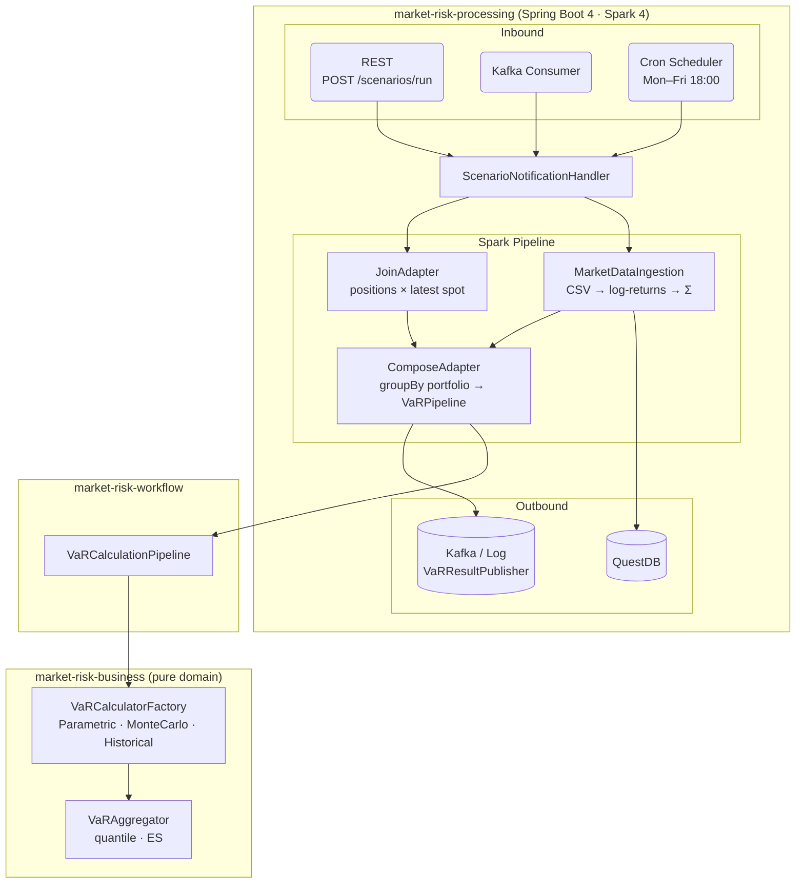

# Market Risk Quant Platform

[](https://github.com/kacemjd/market-risk-quant/actions/workflows/ci.yml)
[](https://codecov.io/gh/kacemjd/market-risk-quant)

Enterprise-grade VaR engine — Parametric, Monte Carlo (Cholesky GBM), and Historical Simulation — built on **strict Hexagonal Architecture** with Spring Boot 4 and Apache Spark 4.

The platform is engineered around two non-negotiable principles:

| Principle | How it is applied |
|---|---|
| **Hexagonal Architecture** | Domain (`market-risk-business`) is 100 % framework-free. All I/O crosses a named port. Adapters are the only code allowed to touch Spring, Spark, Kafka, or QuestDB. Dependency direction is enforced by the Maven module graph: `processing → workflow → business`. |
| **Behavior-Driven Development (BDD)** | All quantitative scenarios are specified as Cucumber feature files before implementation. Feature files act as the living specification of the VaR engine and are executed on every CI run. |

---

## Quick Start (Docker)

**Prerequisites:** Docker & Docker Compose

```bash
docker compose up
```

The REST API is available at `http://localhost:8080`.

### Run a scenario

```bash
curl -X POST http://localhost:8080/scenarios/run \
  -H "Content-Type: application/json" \
  -d '{
    "portfolioCsvPath": "/data/portfolio.csv",
    "pricesCsvPath":    "/data/prices",
    "asOfDate":         "2024-12-31",
    "confidenceLevel":  0.99,
    "numPaths":         10000,
    "timeGrid":         "GRID_53"
  }'
# → HTTP 202  { "correlationId": "..." }
```

---

## Local Dev (no Docker)

**Prerequisites:** JDK 21+, Maven 3.9+

```bash
# build + tests
mvn clean verify

# run locally (Spark in-process, REST on :8080)
mvn spring-boot:run -pl market-risk-processing -Plocal
```

---

## Stack

| Layer | Technology |
|---|---|
| Language | Java 21 |
| Framework | Spring Boot 4.0.5 |
| Compute | Apache Spark 4.0.0 (Scala 2.13) |
| Persistence | QuestDB |
| Messaging | Apache Kafka (optional) |
| Build | Maven multi-module |

---

## Architecture

Three-module Maven project. Dependency direction is strictly inward: `processing → workflow → business`.

```
market-risk-quant/
├── market-risk-business/     pure domain — Java 21, zero framework
├── market-risk-workflow/     orchestration contracts — no Spring, no Spark
└── market-risk-processing/   Spring Boot 4 + Spark 4 application
```

Inbound triggers: REST, Kafka consumer, cron scheduler.  
Outbound: QuestDB (persistence) + Kafka / logging (VaR result publishing).


```mermaid
flowchart TB
    subgraph PROC["market-risk-processing  (Spring Boot 4 · Spark 4)"]
        direction TB
        subgraph IN["Inbound"]
            REST("REST\nPOST /scenarios/run")
            KFK("Kafka Consumer")
            CRON("Cron Scheduler\nMon–Fri 18:00")
        end

        HANDLER["ScenarioNotificationHandler"]

        subgraph SPARK["Spark Pipeline"]
            INGEST["MarketDataIngestion\nCSV → log-returns → Σ"]
            JOIN["JoinAdapter\npositions × latest spot"]
            COMPOSE["ComposeAdapter\ngroupBy portfolio → VaRPipeline"]
        end

        subgraph OUT["Outbound"]
            DB[("QuestDB")]
            PUB[("Kafka / Log\nVaRResultPublisher")]
        end
    end

    subgraph WF["market-risk-workflow"]
        VPL["VaRCalculationPipeline"]
    end

    subgraph BIZ["market-risk-business  (pure domain)"]
        CALC["VaRCalculatorFactory\nParametric · MonteCarlo · Historical"]
        AGG["VaRAggregator\nquantile · ES"]
    end

    REST & KFK & CRON --> HANDLER
    HANDLER --> INGEST & JOIN
    INGEST --> DB
    INGEST & JOIN --> COMPOSE
    COMPOSE --> VPL --> CALC --> AGG
    COMPOSE --> PUB
```

---

## Data Formats

**Portfolio CSV** — `portfolioId,ticker,quantity,assetClass`

**Prices CSV** — `Ticker,Date,Open,High,Low,Close,Volume,OpenInt`  
(`Date` must be `YYYY-MM-DD`; only `Ticker`, `Date`, `Close` are consumed.)

---

## Testing

```bash
mvn test -pl market-risk-business                         # unit tests
mvn test -pl market-risk-business -Dtest=CucumberRunner   # BDD
mvn verify -pl market-risk-processing                     # integration
```

---

## Roadmap

| Sprint | Theme | Items |
|---|---|---|
| ✅ 1 | Foundation | Hexagonal layout, REST validation, CI, immutable aggregator |
| ✅ 2 | Persistence & Delivery | QuestDB, Kafka publisher, Docker Compose, Flyway migrations, VaR query API |
| 🔄 3 | Observability | Micrometer metrics, Prometheus scrape endpoint, Grafana dashboard, structured JSON logging, correlation-ID tracing through all layers |
| 📋 4 | Distributed Tracing | OpenTelemetry SDK, Jaeger/Tempo export, span propagation across Spark stages, trace-aware error reporting |
| 📋 5 | Advanced Quant | Component VaR (Euler allocation), Filtered Historical Simulation, Stress Testing |
