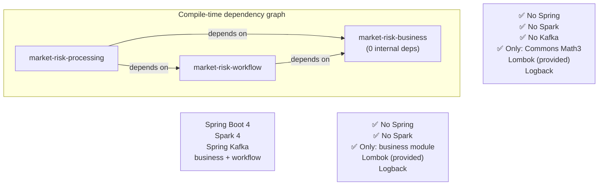

# Architecture Review

> _Reviewed April 2026 — Phase 1 codebase._

## Overall Assessment: **Strong foundation — well-suited for incremental evolution**

The project demonstrates disciplined adherence to hexagonal architecture and clean separation of concerns across three well-scoped Maven modules. Dependency direction is enforced at the build level and the domain module is genuinely framework-free. This is significantly above average for a Phase 1 prototype and positions the system well for the multi-phase roadmap.

---

## Scorecard

| Criterion | Rating | Notes |
|---|:---:|---|
| **Hexagonal purity** | ⭐⭐⭐⭐⭐ | Textbook implementation — ports defined in business, adapters in processing, zero Spring leaks into domain |
| **Dependency direction** | ⭐⭐⭐⭐⭐ | Maven enforces `business ← workflow ← processing`; no reverse or circular dependencies |
| **Domain model richness** | ⭐⭐⭐⭐ | Immutable value objects (`@Value`), factory methods (`Position.equitySpot`), domain exceptions; room to grow as asset classes expand |
| **Testability** | ⭐⭐⭐⭐⭐ | Three distinct test layers (unit/BDD/integration) each exercising the right scope; JMH for performance-critical paths |
| **Single Responsibility** | ⭐⭐⭐⭐ | Each class has a clear, narrow job; `MarketDataCalibrationService` does a lot but each method is focused |
| **Open/Closed (strategy pattern)** | ⭐⭐⭐⭐⭐ | `VaRPipeline` interface + `MonteCarloVaRPipeline` — adding Historical Sim VaR is a new class, zero changes to existing code |
| **Infrastructure isolation** | ⭐⭐⭐⭐⭐ | Spark, Kafka, REST, Scheduler all live behind `@Conditional` / `@Profile`; can swap, disable, or replace independently |
| **Scalability readiness** | ⭐⭐⭐⭐ | Spark `local[*]` → `yarn` is one property; in-memory stubs are the only blocking gap for horizontal scale |
| **Operational readiness** | ⭐⭐⭐ | Logging is solid; metrics, tracing, and health checks are absent (planned Phase 5) |
| **API design** | ⭐⭐⭐ | REST endpoint works but no validation, error handling, or OpenAPI spec yet |

---

## What was done right

### 1. Genuine hexagonal layering enforced by Maven modules

```
business  (0 framework deps)  ←  workflow (Lombok only)  ←  processing (Spring, Spark, Kafka)
```

The dependency graph is strictly unidirectional, enforced at compile time by Maven. The domain module has **no** Spring, Spark, or Kafka dependency — only Commons Math3 for numerical computation, Lombok (compile-only), and Logback for logging. This is the hardest part of hexagonal architecture to get right, and it's done correctly here.

### 2. Ports are explicit and well-documented

- **Driving ports** (`port/in`): `CalculateVaRUseCase`, `RunMonteCarloVaRUseCase`, `CalibrateMarketDataUseCase` — each with Javadoc contracts
- **Driven ports** (`port/out`): `MarketDataRepository`, `PortfolioRepository`, `VaRResultPublisher` — labelled as SPI in their Javadoc

The ports use pure domain types as parameters and return values. No DTO leakage across the hexagonal boundary.

### 3. Strategy pattern for VaR methodology

`VaRPipeline` is a clean strategy interface. `DomainConfig` wires the active implementation (`MonteCarloVaRPipeline`). Adding Historical Simulation VaR in Phase 3 is:
1. Write a new `HistoricalSimVaRPipeline implements VaRPipeline`
2. Add a config toggle in `DomainConfig`
3. Zero changes to `ComposeAdapter`, `ScenarioNotificationHandler`, or any existing code

This is textbook Open/Closed principle.

### 4. Immutable domain model

All domain objects use Lombok `@Value` (immutable) + `@Builder`. There are no setters. `MarketData`, `VaRResult`, `Portfolio`, `Position`, `ScenarioNotification` are all frozen after construction. This eliminates a large class of concurrency bugs when Spark partitions process in parallel.

### 5. Multiple trigger modes without code duplication

REST, Kafka, and Cron all converge on the same `TriggerScenarioUseCase.trigger(ScenarioNotification)` method. The `ScenarioNotification` acts as a single canonical command object. Each adapter only handles its own deserialization/mapping, then delegates to the shared use case. Adding a fourth trigger (e.g. gRPC, SQS) requires only a new inbound adapter.

### 6. Performance-conscious numerics with evidence

The `computeVarianceLoop` vs `computeVarianceMatrix` comparison is backed by JMH benchmarks with published results. The chosen implementation avoids heap allocation on the hot path (zero `new` inside the inner loop). This discipline is critical for a system that will scale to thousands of risk factors.

### 7. Conditional infrastructure wiring

- `KafkaConfig` → `@ConditionalOnProperty(name = "spring.kafka.bootstrap-servers")` — Kafka beans never load unless explicitly activated
- `RestScenarioController` → `@Profile("rest")` — web layer only available when requested
- `ScheduledScenarioTrigger` → `@ConditionalOnProperty(name = "scenario.schedule.enabled", havingValue = "true")`

This means the same JAR can run as a batch job, REST server, Kafka consumer, or scheduled cron — with no dead code in the context.

### 8. End-to-end integration test with real Spark

`ScenarioPipelineIT` boots the full Spring + Spark context, reads real CSV test data, runs the complete pipeline from `TriggerScenarioUseCase.trigger()` through calibration, enrichment, Monte Carlo VaR, and publishing, and asserts on the final result. This catches wiring errors that unit tests miss.

---

## Areas for improvement

### 1. Typo in core domain class: `Portoflio` → `Portfolio`

`Portoflio.java` is misspelled. This propagates through every file that references it — `VaRPipeline`, `ComposeAdapter`, `ParametricVaRCalculator`, `PortfolioRepository`, etc. Fix with a single rename refactor before the class appears in any public API or serialised form.

### 2. No root Java package

All modules use bare top-level packages (`domain`, `application`, `infrastructure`, `workflow`). This works but risks classpath collisions when the artefact is deployed alongside other libraries. Industry convention is a reverse-domain root, e.g. `com.example.marketrisk.domain`. Consider renaming before Phase 2 solidifies public APIs.

### 3. `VaRCalculator` vs `CalculateVaRUseCase` — redundant interface pair

`VaRCalculator` (domain service interface) and `CalculateVaRUseCase` (driving port) define the same operation with slightly different signatures. `ParametricVaRCalculator implements VaRCalculator`, but nothing implements `CalculateVaRUseCase`. Either consolidate them or have `ParametricVaRCalculator` also implement the port, so it can be injected through the hexagonal boundary.

### 4. `MarketDataCalibrationService` is not wired through a port

`SparkMarketDataIngestionAdapter` directly depends on `MarketDataCalibrationService` (concrete class), bypassing the `CalibrateMarketDataUseCase` port. The port exists but has no consumer. Either:
- Have `MarketDataCalibrationService` implement `CalibrateMarketDataUseCase` and inject via the interface, or
- Acknowledge that this service is a domain utility (not a use case) and remove the unused port to avoid confusion.

### 5. `ComposeAdapter` collects all partitions to the driver

```java
Map<String, List<EnrichedPositionRow>> byPortfolio = enriched.collectAsList()
        .stream()
        .collect(Collectors.groupingBy(EnrichedPositionRow::getPortfolioId));
```

`collectAsList()` pulls the entire dataset to the Spark driver's JVM heap. This works for dozens of portfolios but will OOM at scale. Phase 4 should replace this with a `groupByKey` + `mapPartitions` to keep execution distributed.

### 6. No input validation on the REST endpoint

`RestScenarioController.run()` accepts `ScenarioRequest` without any `@Valid` / Bean Validation constraints. Missing `asOfDate`, null `pricesCsvPath`, or `confidenceLevel = -5` will propagate deep into the pipeline before failing with a confusing domain exception. Add `@NotNull`, `@Min`, `@Max`, and a `@RestControllerAdvice` error handler.

### 7. No global exception handling

Domain exceptions (`DomainException`, `VaRCalculationException`) exist but nothing catches them at the adapter boundary. A Cholesky decomposition failure (non-positive-definite matrix) will surface as an unhandled `NonPositiveDefiniteMatrixException` from Commons Math. Add an exception translation layer in the adapters.

### 8. Spark provided scope may complicate local development

Spark is declared `<scope>provided</scope>` in the processing POM, which is correct for cluster deployment but requires a manually configured classpath for local `java -jar` execution. Consider a `local` Maven profile that overrides the scope to `compile` for developer convenience.

### 9. Seed hardcoded in `MonteCarloVaRPipeline`

`MonteCarloVaRService` defaults `seed = 42L`. The `ScenarioNotification` does not carry a seed field, so every production run produces identical random paths. For production use, the seed should either be derived from `correlationId` (for reproducibility) or set to `System.nanoTime()` (for independence).

### 10. `VaRAggregator` is mutable

`VaRAggregator` uses a fluent setter pattern (`atConfidence(double)`) that mutates internal state. This is inconsistent with the rest of the domain, which is strictly immutable (`@Value`). Prefer a builder or constructor-injected confidence level.

---

## Dependency direction verification



**Verdict:** The dependency arrows all point inward toward the domain. No framework dependency leaks outward. This is correct hexagonal architecture.

