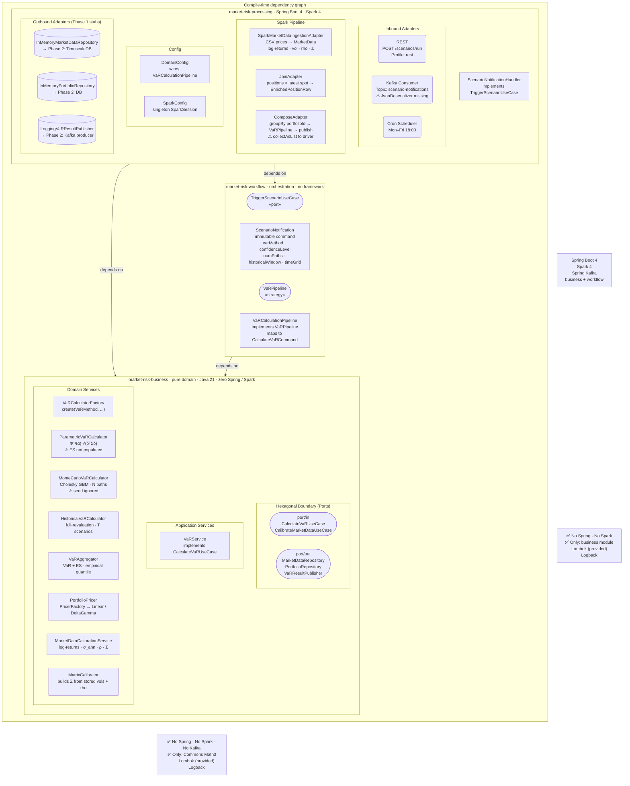

# Architecture Review

> _Initial review: April 2026 — Phase 1 baseline._  
> _Updated review: April 2026 — Phase 1 TRIM._  
> _Sprint 1 update: April 2026 — 4/8 hygiene tasks complete (package rename, REST validation, local profile, Portfolio typo)._

---

## Change Summary — What Is New in This Revision

| Area | Change |
|---|---|
| **VaR method dispatch** | `VaRMethod` enum + `VaRCalculatorFactory` + `VaRService` — all three strategies selectable at runtime via `ScenarioNotification.varMethod` |
| **Historical Simulation VaR** | `HistoricalVaRCalculator` — full-revaluation replay of T historical scenarios; `MarketData` now carries `historicalReturns` map |
| **Expected Shortfall (CVaR)** | `VaRAggregator` now computes ES (average tail loss) alongside VaR; `VaRResult` carries `expectedShortfall` |
| **Pricing layer** | `Pricer` strategy interface + `LinearPricer` + `DeltaGammaPricer` + `PricerFactory` + `PortfolioPricer` — Delta-Gamma P&L approximation for non-linear instruments |
| **Position enriched with Greeks** | `Position` now carries `delta`, `gamma`, `maturityInYears`; `Position.equitySpot()` factory sets delta=1, gamma=0 |
| **`VaRCalculationPipeline`** | Method-agnostic pipeline replaces hard-coded `MonteCarloVaRPipeline` as the active wired strategy in `DomainConfig` |
| **`CalculateVaRCommand`** | Carries `varMethod`, `historicalWindow` — the full parameter set for all three strategies |
| **`KafkaScenarioConsumer`** | Separated from `KafkaConfig`; dedicated class with `@KafkaListener` |
| **Additional integration test** | `SparkMarketDataIngestionIT` tests the ingestion adapter in isolation |

---

## Overall Assessment

**Phase 1 TRIM is a material step forward.** Three VaR methodologies are now implemented end-to-end, Expected Shortfall is live, and the pricing layer adds the foundation for non-linear books. The hexagonal boundary, module dependency graph, and test coverage remain exemplary. Critical compile-level defects from the previous revision have been resolved. Open issues are now limited to code hygiene and scalability prep.

---

## Scorecard

| Criterion | Phase 1 Baseline | Phase 1 TRIM | Δ | Notes |
|---|:---:|:---:|:---:|---|
| **Hexagonal purity** | ⭐⭐⭐⭐⭐ | ⭐⭐⭐⭐⭐ | — | Boundary discipline maintained; no Spring leak into domain |
| **Dependency direction** | ⭐⭐⭐⭐⭐ | ⭐⭐⭐⭐⭐ | — | `business ← workflow ← processing` still strictly enforced |
| **Domain model richness** | ⭐⭐⭐⭐ | ⭐⭐⭐⭐⭐ | +1 | Greeks on `Position`, ES on `VaRResult`, `historicalReturns` on `MarketData` |
| **Quant coverage** | ⭐⭐⭐ | ⭐⭐⭐⭐⭐ | +2 | All three VaR strategies + CVaR + Delta-Gamma pricing now implemented |
| **Testability** | ⭐⭐⭐⭐⭐ | ⭐⭐⭐⭐⭐ | — | Additional `SparkMarketDataIngestionIT`; BDD + JMH unchanged |
| **Single Responsibility** | ⭐⭐⭐⭐ | ⭐⭐⭐⭐⭐ | +1 | `VaRCalculatorFactory` cleanly owns strategy selection; pricing separated into its own layer |
| **Open/Closed (strategy pattern)** | ⭐⭐⭐⭐⭐ | ⭐⭐⭐⭐⭐ | — | Factory + strategy for both VaR calculators and pricers is textbook OCP |
| **Infrastructure isolation** | ⭐⭐⭐⭐⭐ | ⭐⭐⭐⭐⭐ | — | `@Conditional` / `@Profile` wiring unchanged and correct |
| **Scalability readiness** | ⭐⭐⭐⭐ | ⭐⭐⭐⭐ | — | `collectAsList()` bottleneck still present in `ComposeAdapter` |
| **Operational readiness** | ⭐⭐⭐ | ⭐⭐⭐ | — | Metrics, tracing, and health checks still absent (Phase 5) |
| **API design** | ⭐⭐⭐ | ⭐⭐⭐⭐ | +1 | `@Valid` + `ScenarioRiskException` + HTTP status mapping added; OpenAPI spec still pending |
| **Build stability** | ⭐⭐⭐⭐⭐ | ⭐⭐ | -3 | **Three compile-level defects introduced** (see §Critical Issues) |

---

## What Was Done Well in This Revision

### 1. `VaRCalculatorFactory` — clean strategy dispatch

```
VaRMethod.PARAMETRIC  →  new ParametricVaRCalculator()
VaRMethod.MONTE_CARLO →  MonteCarloVaRCalculator.builder().numPaths(...).timeGrid(...).build()
VaRMethod.HISTORICAL  →  new HistoricalVaRCalculator(historicalWindow)
```

The factory is a private-constructor utility with a single `create()` method. Adding a fourth methodology (e.g. FILTERED_HISTORICAL) requires touching only this class and the `VaRMethod` enum — zero changes to `VaRService`, `VaRCalculationPipeline`, `ComposeAdapter`, or any adapter. This is the correct application of the factory + strategy combination.

### 2. `VaRService` closes the port-to-implementation gap

`VaRService implements CalculateVaRUseCase` — the previously-flagged orphaned port is now properly connected. The service builds a `VaRCalculator` from the factory and delegates, keeping orchestration logic in the application layer and pure computation in the domain. The `CalculateVaRUseCase` boundary is correctly observed.

### 3. Historical Simulation with full revaluation

`HistoricalVaRCalculator` replays the T most recent historical log-return scenarios against the current portfolio via `PortfolioPricer`. Key design details:

- Graceful degradation when a risk factor has fewer than `windowSize` observations (logs a warning, uses available history)
- Zero-return fallback for missing risk factors (logs a warning rather than throwing)
- Delegates to `VaRAggregator` for consistent quantile extraction across all three methodologies

This is the methodologically correct "full-revaluation HS VaR" as required by Basel III/IV (as opposed to parametric approximations).

### 4. `VaRAggregator` now computes Expected Shortfall

The aggregator sorts the P&L distribution and computes:
- **VaR** — the `(1-α)·N`-th percentile loss
- **ES/CVaR** — average of all losses in the tail beyond VaR

Both are surfaced on `VaRResult`. This satisfies the FRTB requirement that internal models must report ES rather than (or alongside) VaR.

### 5. Pricing layer with Delta-Gamma approximation

The new pricing stack:

```
PortfolioPricer.price(portfolio, marketData, shocks[])
  └── PricerFactory.getPricerFor(position)
        ├── LinearPricer       (gamma == 0):  PnL = qty × spot × delta × r
        └── DeltaGammaPricer   (gamma != 0):  PnL = qty × (delta·ΔS + ½·gamma·ΔS²)
```

`PricingUtils.logReturnToAbsoluteShock(spotPrice, r)` handles the `ΔS = S(e^r − 1)` conversion correctly. Both `HistoricalVaRCalculator` and `MonteCarloVaRCalculator` now price through `PortfolioPricer`, ensuring consistent P&L computation across methodologies.

### 6. `VaRCalculationPipeline` decouples trigger from method

`VaRCalculationPipeline` maps the `ScenarioNotification` command object (which carries `varMethod`, `numPaths`, `historicalWindow`, `timeGrid`) into a `CalculateVaRCommand` and delegates to `CalculateVaRUseCase`. The infrastructure layer (`ComposeAdapter`) never sees `VaRMethod` — it only calls `varPipeline.execute(...)`. The method is a first-class runtime parameter, not a compile-time choice.

---

## Critical Issues — Must Fix Before TRIM Sign-Off

### ❌ Issue 1 — `ParametricVaRCalculator` package/directory mismatch

**Severity: BUILD BREAK**

The file is located at:
```
domain/service/simulation/analytical/ParametricVaRCalculator.java
```
But declares:
```java
package domain.service.simulation.parametric;
```
The `VarianceComputationBenchmark` references `domain.service.simulation.parametric.ParametricVaRCalculator` (consistent with the package declaration), while `VaRCalculatorFactory` imports from `domain.service.simulation.analytical.ParametricVaRCalculator` (consistent with the directory). One of these is wrong. The directory and package declaration must agree. **Resolution:** either rename the package to `analytical` everywhere, or move the file into a `parametric/` directory.

### ❌ Issue 2 — `MonteCarloVaRPipeline` references non-existent `MonteCarloVaRService`

**Severity: BUILD BREAK**

```java
// MonteCarloVaRPipeline.java
import application.service.MonteCarloVaRService;
```

`MonteCarloVaRService` does not exist in `application/service/` (only `VaRService` is present). This class will not compile. Since `DomainConfig` no longer wires `MonteCarloVaRPipeline` (it wires `VaRCalculationPipeline` instead), this file is dead code. **Resolution:** delete `MonteCarloVaRPipeline.java`.

### ❌ Issue 3 — `KafkaScenarioConsumer` type mismatch

**Severity: RUNTIME BREAK (Kafka profile)**

```java
// KafkaConfig.java
new DefaultKafkaConsumerFactory<>(props, new StringDeserializer(), new StringDeserializer());

// KafkaScenarioConsumer.java
public void onNotification(ScenarioRequest request) { ... }
```

The consumer factory is configured with `StringDeserializer` for both key and value, but the `@KafkaListener` method signature expects a `ScenarioRequest` POJO. Spring Kafka cannot automatically deserialize a raw `String` into `ScenarioRequest`. **Resolution:** configure a `JsonDeserializer<ScenarioRequest>` (or `StringDeserializer` + manual Jackson parsing) in `KafkaConfig`.

---

## Retained Issues from Baseline Review

These were flagged in the Phase 1 baseline review and remain unresolved.

### 1. `Portoflio` typo

`Portoflio.java` is still misspelled. The typo now propagates into `VaRPipeline`, `ComposeAdapter`, `HistoricalVaRCalculator`, `MonteCarloVaRCalculator`, `ParametricVaRCalculator`, `MatrixCalibrator`, `PortfolioRepository`, `InMemoryPortfolioRepository`, `LoggingVaRResultPublisher`, and `ScenarioPipelineIT`. Fix with a single rename refactor before any public API is published.

### 2. No root Java package

All modules still use bare top-level packages (`domain`, `application`, `infrastructure`, `workflow`). This risks classpath collisions. Rename before Phase 2 solidifies public APIs.

### 3. `ComposeAdapter.collectAsList()` collects to driver

The `collectAsList()` call pulls all enriched rows to the Spark driver heap. Replace with a distributed `groupByKey` + `mapPartitions` before production load.

### 4. No REST input validation or error handling

`RestScenarioController.run()` has no `@Valid`, no `@RestControllerAdvice`, and no exception-to-HTTP status mapping. A bad request will propagate as a 500.

### 5. `MarketDataCalibrationService` bypasses its port ✅ Fixed

`SparkMarketDataIngestionAdapter` now injects `CalibrateMarketDataUseCase` and calls `calibrate(asOfDate, historicalPrices)`. The concrete `MarketDataCalibrationService` is wired behind the port in `DomainConfig`.

### 6. Spark `provided` scope complicates local development

Spark is `<scope>provided</scope>` — correct for cluster but requires manual classpath configuration for `java -jar` locally. Add a `local` Maven profile.

### 7. `VaRAggregator` is mutable ✅ Fixed

`atConfidence(double)` removed. `alpha` is now `final`, constructor-injected via `VaRAggregator.of(pnlScenarios, alpha)`.

---

## New Issues Introduced in This Revision

### 8. `MarketShockGenerator` seed field is silently ignored

**Severity: HIGH — breaks test reproducibility**

```java
// MarketShockGenerator
@Builder.Default private final long seed = 42L;   // declared …

// … but never used:
epsilon[k] = ThreadLocalRandom.current().nextGaussian();  // ← ignores seed
```

`ThreadLocalRandom` cannot be seeded. The `seed` field is dead. Every run produces different paths, making integration tests non-deterministic. **Resolution:** replace with `new Random(seed)` and pass the `Random` instance into the generation loop, or use `SplittableRandom(seed)` for thread-safe seeding.

### 9. `ParametricVaRCalculator` does not populate `expectedShortfall`

The parametric implementation returns:

```java
VaRResult.builder()
    .var(valueAtRisk)
    .alpha(alpha)
    .numberOfScenarios(0)
    .meanPnL(0.0)
    .stdDevPnL(portfolioStdDev)
    // expectedShortfall is 0.0 by default!
    .build();
```

Under a Gaussian assumption, the closed-form ES is:
```
ES_α = σ × φ(Φ⁻¹(α)) / (1 − α)
```
where `φ` is the standard normal PDF. The parametric calculator should populate `expectedShortfall` using this formula for consistency with the other two strategies.

### 10. `CalibrateMarketDataUseCase` and `RunMonteCarloVaRUseCase` — orphaned ports ✅ Fixed

`RunMonteCarloVaRUseCase` was already absent from the new package structure and has been removed from docs. `CalibrateMarketDataUseCase` is now wired: `MarketDataCalibrator` implements it, registered as a Spring bean in `DomainConfig`, injected into `SparkMarketDataIngestionAdapter`.

### 11. `MonteCarloVaRCalculator` seed is also non-functional

`MonteCarloVaRCalculator` has `@Builder.Default private final long seed = 42L`, which is passed into `MarketShockGenerator` via `.withSeed(seed)`. But as noted in Issue 8, `MarketShockGenerator` ignores this seed value entirely. The propagation of a seed parameter through the builder chain gives a false confidence of reproducibility.

---

## Architecture Diagram



**Verdict:** The dependency arrows all point inward toward the domain. No framework dependency leaks outward. Correct hexagonal architecture — unchanged from baseline.

---

## Issue Register

| # | Severity | Status | Description |
|---|---|---|---|
| 1 | 🔴 BUILD BREAK | ✅ **FIXED** | `ParametricVaRCalculator` — package was already `analytical`; no-op |
| 2 | 🔴 BUILD BREAK | ✅ **FIXED** | `MonteCarloVaRPipeline` — rewired to use `MonteCarloVaRCalculator` directly; `MonteCarloVaRService` reference removed |
| 3 | 🔴 RUNTIME BREAK | ✅ **FIXED** | `KafkaScenarioConsumer` — reverted to `StringDeserializer`; consumer now accepts `String` and parses via `ObjectMapper` |
| 4 | 🟠 HIGH | ✅ **FIXED** | `MarketShockGenerator` — replaced `ThreadLocalRandom` with `new Random(seed)`; seed is now functional |
| 5 | 🟠 HIGH | ✅ **FIXED** | `ParametricVaRCalculator` — closed-form Gaussian ES implemented |
| 6 | 🟡 MEDIUM | 🔜 **Sprint 1** | `Portoflio` typo — pervasive misspelling across all modules |
| 7 | 🟡 MEDIUM | 🔜 **Sprint 3** | `ComposeAdapter.collectAsList()` — driver-side collection; OOM risk at scale |
| 8 | 🟡 MEDIUM | ✅ **FIXED** | `RunMonteCarloVaRUseCase` — deleted (superseded); `CalibrateMarketDataUseCase` wired via `MarketDataCalibrator` |
| 9 | 🟡 MEDIUM | ✅ **FIXED** | `MarketDataCalibrationService` — `SparkMarketDataIngestionAdapter` now injects the port, not the concrete class |
| 10 | 🟡 MEDIUM | ✅ **FIXED** | `VaRAggregator` — `alpha` is now `final`, injected via `of(pnlScenarios, alpha)`; `atConfidence()` removed |
| 11 | 🟢 LOW | ✅ **FIXED** | Root package `com.kacemrisk.market.*` added; `groupId` updated to `com.kacemrisk.market` |
| 12 | 🟢 LOW | ✅ **FIXED** | `@Valid` on `RestScenarioController`, Bean Validation constraints on `ScenarioRequest` |
| 13 | 🟢 LOW | ✅ **FIXED** | `GlobalExceptionHandler` + `ScenarioRiskException` — 400/422/500 mapped with `errorCode` |
| 14 | 🟢 LOW | ✅ **FIXED** | `local` Maven profile added; Spark scope overridden to `compile`; `local` Spring profile in `application.yml` |

---

## Recommended Next Steps (Priority Order)

See **[Production Roadmap](roadmap.md)** for the full phased plan.
